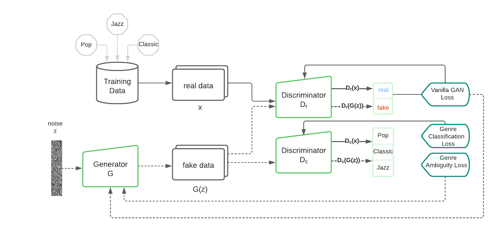

# iannwtf-group21-project
As the final project of the Course "Implementing Artificial Neural Networks with Tensorflow" at the University of Osnabrueck we implemented a Creative Adversarial Network (CAN) to generate new music. Due to its architecture and the Genre Ambiguity loss the network can learn to generate music that diverges from the training data. Meaning, it generates music that cannot directly be traced back to a specific music genre available in the training dataset. 
The project is based on the work of [Nao Tokui](https://arxiv.org/abs/2011.13062#:~:text=%2D%2D%20Generating%20novel%20rhythm%20patterns%20using%20GAN%20with%20Genre%20Ambiguity%20Loss,-Nao%20Tokui&text=The%20paper%20shows%20that%20our,genres%20in%20the%20training%20dataset) who used a Creative Adversarial Network to generate new electronic rhythm patterns [[1]](#1). We trained our model with pop, jazz and classical music in MIDI format. Nonetheless, it is also possible to use other music genres as training data. \
For further information, please refer to our [paper]().
<p align="center">
  
</p>

## Listen to a generated sample...
https://user-images.githubusercontent.com/64217756/160562626-822ef371-61f3-425b-9046-5d2d08f5d116.mov

## Repository structure and how to use
- `model.py` contains the GAN as well as the Discriminator and Generator class
- `training_utilities.py` contains the training loop and utility functions used during training to obtain sheet music and audio of the generated samples
- `preprocessing.py` contains functions to prepare new datasets in the same format used by the model
- `models` contains the trained models
- `datasets` contains the preprocessed datasets as one tensorflow dataset
- `Training.ipynb` contains code to run the training while logging to tensorboard
- `GenerateSamples.ipynb` can be used to load a stored model and generate new samples from it

To easily run these things in Colab there are additional "InColab" notebooks, which contain specific setup sections in the beginning of the notebooks.


Some parts of the training, generation of samples, and preprocessing require certain libraries and software to be installed. We provide an environment.txt file for hassle-free setup of an environment containing the necessary python libraries. However, to generate the sheet music a recent version of Musescore also needs to be installed, which can be done using the following commands.
```
sudo add-apt-repository ppa:mscore-ubuntu/mscore-stable -y
sudo apt-get update
sudo apt-get install musescore
```
It is possible that the music21 library cannot find the musescore installation, in that case running this python code should solve the issue:
```
import music21
us = music21.environment.UserSettings()
us['musescoreDirectPNGPath'] = '/usr/bin/mscore'
us['directoryScratch'] = '/tmp'
```


## Datasets
We used the following datasets. They all contain music in MIDI file format.

- [Pop Dataset](https://github.com/music-x-lab/POP909-Dataset) [[2]](#2)
- [Jazz Dataset](https://github.com/lucasnfe/adl-piano-midi) [[3]](#3): This dataset also contains several other genres that might be interesting for further purposes. 
- [Classic Dataset](https://www.kaggle.com/datasets/soumikrakshit/classical-music-midi)  [[4]](#4)

## References
<a id="1">[1]</a> 
Nao Tokui. Can gan originate new electronic dance music genres? - Generating novel rhythm patterns using gan with genre ambiguity loss. *arXiv preprint arXiv: 2011.13062*, 2020.

<a id="2">[2]</a> 
Wang Ziyu, Ke Chen, Junyan Jiang, Yiyi Zhang, Maoran Xu, Shuqi Dai, Guxian Bin, and Gus Xia. Pop909: A Pop-Song Dataset for Music Arrangement Generation. In *Proceedings of 21st International Conference on Music Information Retrieval, ISMIR.* 2020.

<a id="3">[3]</a> 
Lucas N. Ferreira, Levi H. S. Lelis, and Jim Whitehead. Computer-generated music for table top role-playing games. 2020.

<a id="4">[4]</a> 
[Bern Krueger](http://www.piano-midi.de/), [cc-by-sa Germany License](https://creativecommons.org/licenses/by-sa/3.0/de/deed.en), splitted the songs.


